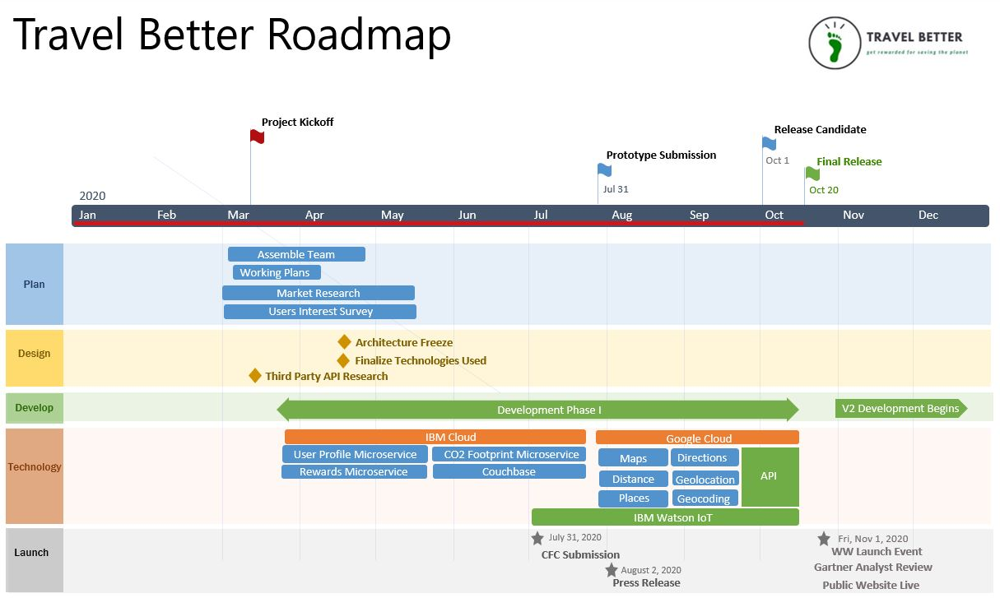

# TravelBetter - Getting there Greener

[](https://www.apache.org/licenses/LICENSE-2.0) [](https://callforcode.org/slack) [](https://code-and-response.github.io/Project-Sample/)

A basic GitHub repository example for Call for Code submissions and those projects that join the Code and Response initiative. Not all sections or files are required. You can make this as simple or as in-depth as you need.

*Read this in other languages: [English](README.md), [한국어](README.ko.md), [português](README.pt_br.md).*

## Contents

1. [Short description](#short-description)
1. [Demo video](#demo-video)
1. [The architecture](#the-architecture)
1. [Sequence Diagram](#sequence-diagram)
1. [Long description](#long-description)
1. [Project roadmap](#project-roadmap)
1. [Getting started](#getting-started)
1. [Running the tests](#running-the-tests)
1. [Live demo](#live-demo)
1. [Built with](#built-with)
1. [Contributing](#contributing)
1. [Versioning](#versioning)
1. [Authors](#authors)
1. [License](#license)
1. [Acknowledgments](#acknowledgments)

## Short description
Application to easily motivate and reward people for making greener transportation choices. 

### What's the problem?

Global warming refers to the steady temperature rise on our earth. Both land and oceans are warmer now than they were when record-keeping began, in 1880. The U.S. Energy Information Administration states that greenhouse gases are gases that keep heat in the earth’s atmosphere. Although greenhouse gases do occur naturally, human activity contributes a great deal to greenhouse gas emissions. Your carbon footprint — or your impact on the environment — measures the greenhouse gases that you are responsible for creating. Common activities like using electricity and driving a car emit those gases. Usually, the bulk of an individual’s carbon footprint will come from transportation, housing, and food. OR:
Your carbon footprint — or your impact on the environment — measures the greenhouse gases that you are responsible for creating. Common activities like using electricity and driving a car emit those gases. Existing programs to help guide people in reducing their carbon footprint are cumbersome and unrewarding for a majority of people. 

### How can technology help?

While scientists and environmentalists are working on building solutions to reduce global warming, technologists can build solutions to make people more carbon aware and provide simple and easy ways to reduce it. Technology can motivate people to make better choices in order to reduce their personal carbon footprint. 

### The idea

Our idea is make people aware of the carbon impact of their transportation choices, provide greener alternatives, and offer rewards for choosing more environmentally friendly options. OR:
Our solution is to reward people for making better choices when they commute. The simplicity will entice more people to make green choices and, in turn, produce a positive impact on an individual’s carbon footprint. 

## Demo video

[](https://youtu.be/vOgCOoy_Bx0)

## The architecture


## Sequence Diagram


1. The user opens app on ios device. Home page loads with an option to search transportation between **to** and **from** location.
2. App will track transportaion option used.
3. Reward user for choosing environment friendly transportation uses.
4. User's activity history will be stored in couchDB on Cloudant.

## Long description

[More detail is available here]  https://docs.google.com/document/d/1FS9JgiJnzqeq37P7SOzykA6unKFmfhaZGWISB468fQg/edit

## Project roadmap



## Getting started

These instructions will get you a copy of the project up and running on your local machine for development and testing purposes. See deployment for notes on how to deploy the project on a live system.

### Prerequisites

What things you need to install the software and how to install them

```bash
# If you don't have expo-cli yet, get it
npm i -g expo-cli
# If you don't have react-native-cli yet, get it
npm i -g react-native-cli
# This is a shortcut to skip the UI for picking the template
expo init --template bare-minimum
```

### Installing

A step by step series of examples that tell you how to get a development env running

Say what the step will be, for example

```bash
export TOKEN="fffd0923aa667c617a62f5A_fake_token754a2ad06cc9903543f1e85"
export EMAIL="jane@example.com"
dnf install npm
node samplefile.js
Server running at http://127.0.0.1:3000/
```

And repeat

```bash
curl localhost:3000
Thanks for looking at Code-and-Response!
```

End with an example of getting some data out of the system or using it for a little demo

## Running the tests

Explain how to run the automated tests for this system

### Break down into end to end tests

Explain what these tests test and why, if you were using something like `mocha` for instance

```bash
npm install mocha --save-dev
vi test/test.js
./node_modules/mocha/bin/mocha
```

### And coding style tests

Explain what these tests test and why, if you chose `eslint` for example

```bash
npm install eslint --save-dev
npx eslint --init
npx eslint sample-file.js
```

## Live demo

You can find a running system to test at [callforcode.mybluemix.net](http://callforcode.mybluemix.net/)

## Built with

* [IBM Cloudant](https://cloud.ibm.com/catalog?search=cloudant#search_results) - The NoSQL database used
* [IBM Cloud Functions](https://cloud.ibm.com/catalog?search=cloud%20functions#search_results) - The compute platform for handing logic
* [IBM API Connect](https://cloud.ibm.com/catalog?search=api%20connect#search_results) - The web framework used
* [Dropwizard](http://www.dropwizard.io/1.0.2/docs/) - The web framework used
* [Maven](https://maven.apache.org/) - Dependency management
* [Springboot](https://start.spring.io/) - Used to generate backend user , activity CRUD APIs

## Contributing

Please read [CONTRIBUTING.md](CONTRIBUTING.md) for details on our code of conduct, and the process for submitting pull requests to us.

## Versioning

We use [SemVer](http://semver.org/) for versioning. For the versions available, see the [tags on this repository](https://github.com/your/project/tags).

## Authors

* **Joel Conybear**
* **Lauren Colalillo**
* **Mutugi**
* **Preeti Gupta**
* **Rakib Shahriar**


See also the list of [contributors](https://github.com/Code-and-Response/Project-Sample/graphs/contributors) who participated in this project.

## License

This project is licensed under the Apache 2 License - see the [LICENSE](LICENSE) file for details

## Acknowledgments

* Based on [Billie Thompson's README template](https://gist.github.com/PurpleBooth/109311bb0361f32d87a2).
